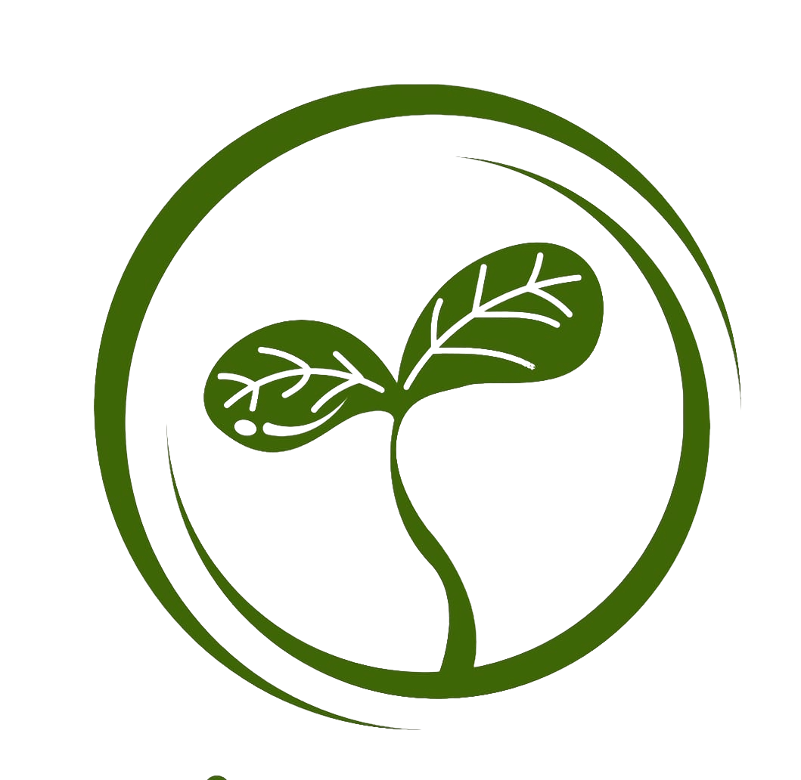

<table>
  <tr>
    <td style="border: none;">
      
    </td>
    <td style="border: none; padding-left: 10px;">
      <h1 style="margin: 0;">Zerkhez: AI-Based Nitrogen Fertilizer Optimizer</h1>
    </td>
  </tr>
</table>


**Zerkhez** is an AI-based mobile application designed to help farmers optimize the use of nitrogen fertilizer for major crops such as **rice, wheat, and maize**. 

## 📖 About the Project

In Pakistan, many farmers lack access to expensive nitrogen estimation tools like GreenSeeker devices and satellite-based systems. This often results in over-fertilization or under-fertilization, leading to reduced crop yields, increased costs, and environmental harm.

Zerkhez addresses this problem by providing a **low-cost, accessible, and offline-capable solution**. Using image processing and machine learning techniques, the application estimates nitrogen levels from images of crop leaves captured using a smartphone. Based on these estimates, along with crop age and recent weather data, the app provides personalized fertilizer recommendations. Voice assistance and alerts are included to support farmers with low literacy levels and limited internet connectivity.

## 🎯 End Goal

Our goal is to democratize precision agriculture for small-scale farmers. By improving Nitrogen Use Efficiency (NUE), we aim to:
- Reduce fertilizer costs and waste.
- Increase crop yields.
- Minimize environmental impact caused by nitrogen runoff.

## 🚀 Project Scope

The application focuses on the following key areas:

- **Nitrogen Estimation:** Uses leaf color analysis (image segmentation and color-based features) to estimate nitrogen levels in rice, wheat, and maize.
- **Fertilizer Recommendation:** Provides personalized dosage recommendations tailored to the crop's growth stage and age.
- **Offline Capability:** Designed to function in rural areas with limited internet connectivity.
- **Voice Assistance:** Guides users through the process, making the app accessible to those with lower literacy.
- **Alerts & Reminders:** Notifies farmers when it's time to recheck nitrogen levels or apply fertilizer.

## � Tech Stack

### Frontend
- **React Native** – Cross-platform mobile application development
- **Expo CLI** – Simplified build and testing
- **SpeechRecognition** – Voice commands and audio feedback
- **Axios** – API communication

### Backend
- **Python 3.12**
- **Flask** – RESTful API development
- **Node.js** – Backend runtime and API integration

### AI & Image Processing
- **TensorFlow** – Deep learning model training
- **OpenCV** – Image preprocessing and segmentation
- **NumPy** – Numerical computation and feature extraction
- **K-Means Clustering** – Leaf segmentation and nitrogen-related color analysis

### Database
- **SQLite** – Lightweight database for user data and history

## 📊 Dataset Details

The project utilizes an **Image-based dataset of crop leaves** for **Rice, Wheat, and Maize (Corn)**.

- **Data Source:** Primary collection using mobile phone cameras under real field conditions.
- **Validation Data:** Nitrogen level readings from a **GreenSeeker** device (ground truth).

### Data Content
Each entry consists of:
- **Crop type** (Rice / Wheat / Maize)
- **Leaf image** (RGB)
- **Nitrogen level reference** (from GreenSeeker)
- **Crop age / growth stage**
- **Timestamp** and **Weather conditions** (last 10 days)

### Characteristics
- **Size:** Large-scale collection across low, medium, and sufficient nitrogen conditions.
- **Preprocessing:** Resizing, noise removal, K-means segmentation, and background removal.
- **Usage:** Training/Validation of the nitrogen estimation model and comparison with GreenSeeker.

## �🔬 Research Contributions

This project contributes to **precision agriculture** by:
*   Providing a cost-effective alternative to expensive hardware like GreenSeeker.
*   Applying advanced image segmentation for accurate nitrogen estimation on mobile devices.
*   Validating results against ground-truth GreenSeeker readings.
*   Creating a practical, offline-first solution for developing regions.

## � Development Phases

The project development is divided into two main phases:

### Phase 1: Frontend Development (Current Status)
- Implementation of the complete user interface using **React Native**.
- Integration of **Expo Camera** for image capture.
- Development of offline-first instructions and navigation flows.
- UI/UX design and implementation for crop selection, instructions, and results.

### Phase 2: Backend Integration & AI Model (Planned)
- Integration of the **Flask** backend with the React Native app.
- Connection to the AI model for real-time nitrogen estimation.
- Implementation of the **SQLite** database for user history.
- API development for fetching weather data.

## �👥 Team Members

| Name | Registration No. | Email | Role / Responsibilities |
|---|---|---|---|
| **Zainab Mehmood** (Group Lead) | BCSF22M038 | bcsf22m038@pucit.edu.pk | Project coordination, frontend development, system architecture |
| **Hamid Ahmad** | BCSF22M011 | bcsf22m011@pucit.edu.pk | Backend APIs, AI integration, Literature review |
| **Ashjia Alvi** | BCSF22M032 | bcsf22m032@pucit.edu.pk | Dataset collection, UI/UX, database management |
| **M. Aaqil Irshad** | BCSF22M053 | bcsf22m053@pucit.edu.pk | AI/ML model, image processing, voice assistant, frontend |

## 📂 Repository Structure

The project is built using **React Native with Expo**.

```
nitrogen/
├── app/                 # Main application source code (screens, standard Expo router pages)
├── assets/              # Static assets (images, fonts, etc.)
├── components/          # Reusable UI components
├── constants/           # App-wide constants (colors, layout settings)
├── hooks/               # Custom React hooks
├── scripts/             # Utility scripts
├── project_details.md   # Detailed project documentation
└── README.md            # Project overview (this file)
```

## 🛠️ Setup and Run

To run this project locally, you need to have **Node.js** installed.

1.  **Clone the repository** (if you haven't already).
2.  **Install dependencies**:

    ```bash
    npm install
    ```

3.  **Start the app**:

    ```bash
    npx expo start
    ```

4.  **Run on a device/emulator**:
    *   Scan the QR code with the **Expo Go** app on your Android/iOS device.
    *   Press `a` to run on an Android Emulator.
    *   Press `i` to run on an iOS Simulator.
    *   Press `w` to run in a web browser.

---

## 📞 Contact

For inquiries, please contact:

**Project Supervisor**  
**Dr. M. Shahid Farid**  
Associate Professor,  
Department of Computer Science, University of the Punjab  
📧 [shahid@pucit.edu.pk](mailto:shahid@pucit.edu.pk)

**Group Leader**  
**Zainab Mehmood**  
📧 [bcsf22m038@pucit.edu.pk](mailto:bcsf22m038@pucit.edu.pk)

---

**License:** This project is developed as part of the Final Year Project (FYP) at the Department of Computer Science, FCIT, University of the Punjab.
